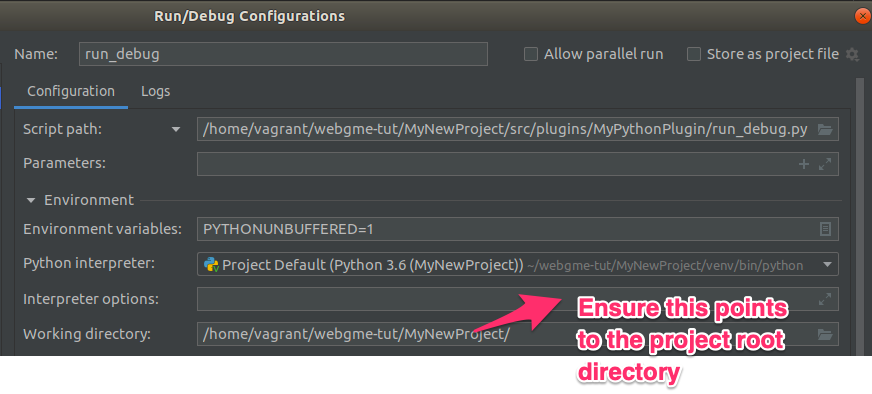
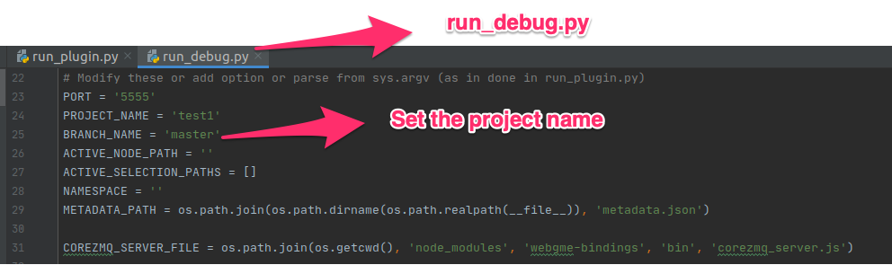
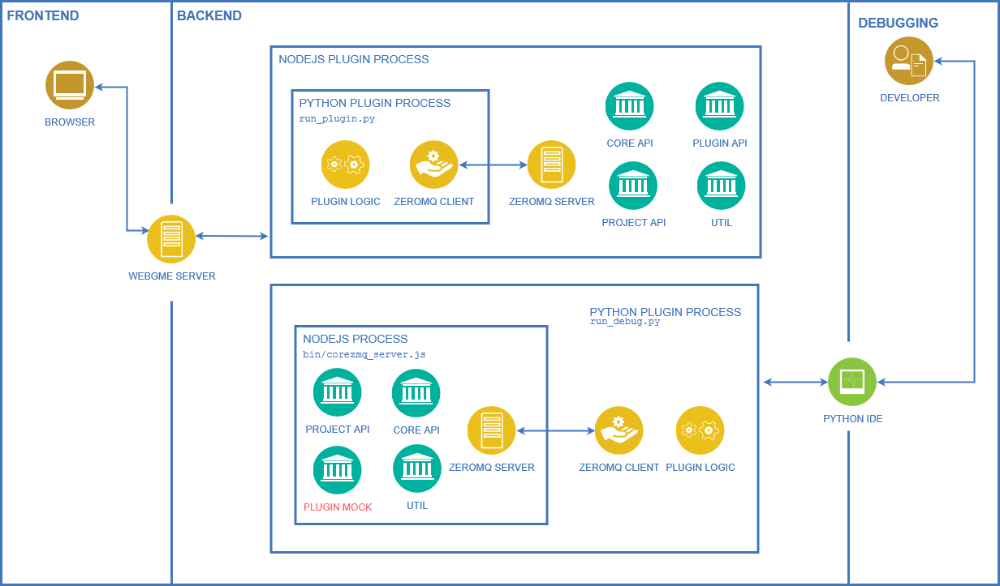

# WebGME-Bindings
This module provides bindings to the Core, Project and certain extent
PluginBase APIs of WebGME. This allows developers to implement plugin logic
without using JavaScript. The implementation is a simple client-server
approach using [ZeroMQ](http://zeromq.org/).

- Currently only Python is supported ([info on how to add another language](./scripts/README.md))
- A non-native plugin still needs a "wrapping" plugin in JavaScript that starts the ZeroMQ-server
and invokes the non-native plugin. For Python - the boiler-plate code (including a debug entry) can be
generated from `webgme-cli` with the command:
```
webgme new plugin MyPythonPlugin --language Python
```


## Getting started
Before getting started make sure that you have [all the webgme dependencies and set
up and a webgme-app repo initialized and working](https://webgme.readthedocs.io/en/latest/getting_started/dependencies.html).
Make sure your webgme version is >= 2.30. (and the webgme-engine version >= 2.21.1 in the global webgme-cli module).

- Add `webgme-bindings` as a dependency.
```
npm install webgme-bindings --save
```

(To install directly from github instead use: `npm install webgme/bindings#master --save`.)

To add a router to your deployment that serves the documentation invoke:
```
webgme import router BindingsDocs webgme-bindings
```

Once your webgme-server is up and running the documentation will be available at `<host>/bindings-docs/`,
e.g. [http://localhost:8888/bindings-docs/](http://localhost:8888/bindings-docs/)

### Setting up Python
The python api is confirmed to work both with both `2.7` and `3.x`. The only third part dependency is
[pyzmq](https://github.com/zeromq/pyzmq) which should work [down to 2.5](https://pyzmq.readthedocs.io/en/latest/pyversions.html).

Note that in the Python API strings are documented as `str` even though in python `2.7` they technically are `unicode`.
(PyZMQ has an explanation of the differences for the interested one [over here](https://pyzmq.readthedocs.io/en/latest/unicode.html).)

1. Install python and make sure it's added to PATH (typing `python` in a shell/cmd should start the python REPL).
2. Install [pip](https://pypi.org/project/pip/) (with the later versions of python 3 it comes packaged with some installers).

#### Installing from https://pypi.org/

```pip install webgme-bindings```

#### Installing from source
1. ```git clone https://github.com/webgme/bindings.git```
2. `cd bindings/python/webgme_bindings`
3. `pip install -e .`


## Generating a python plugin
From the root of your repository generate a new plugin with (replacing `MyPythonPlugin` with something more suitable):
```
webgme new plugin MyPythonPlugin --language Python
```

This will generate three python files:
- `run_plugin.py` - The entry point when running MyPythonPlugin.js
- `run_debug.py` - An entry point for debugging the python code.
- `MyPythonPlugin/__init__py` - The actual implementation of your python plugin.

Make sure to read through the documentation at the top of each file!

Since the python plugins must run on the server, server-side execution of plugins must be enabled.
In your `./config/config.default.js` add the following line (right before the `module.exports = config;` statement:
```javascript
config.plugin.allowServerExecution = true;
```

#### Debugging the plugin
Note that all of these commands should run from the root of your repository:
1. Running the JS plugin from command-line:
```
node node_modules/webgme-engine/src/bin/run_plugin.js MyPythonPlugin MyProject
```
For details about available options:
```
node node_modules/webgme-engine/src/bin/run_plugin.js --help
```
2. Running with python as main process:
```
python src/plugins/MyPythonPlugin/run_debug.py
```
Listing details about options for the corezmq_server.js (called from `run_debug.py`)
```
node node_modules/webgme-bindings/bin/corezmq_server.js --help
```

### Working with PyCharm IDE

If working with the Pycharm IDE make sure to follow these points:
1. Execute pycharm from the commandline, so that it properly captures the
nodejs PATH settings from the terminal's ~/.bashrc file(if using nvm for managing node)
2. Set the working-dir from the run/debug configuration for the project to point to the project's root.

3. Set the project name and other associated variables in the `run_debug.py` file



## Architectural Overview


## Why ZeroMQ?
It is:
- cross-platform and runs on windows and unix-like systems.
- providing [bindings](http://zeromq.org/bindings:_start) in a wide range of languages.
- lightweight and designed with performance in mind.
- used [elsewhere](http://www.zerorpc.io/) to bridge APIs over language barriers.
- a living and maintained technology with a [large community](https://github.com/zeromq) (at least in August 2018).
- open source and has a non-invasive [license](http://zeromq.org/area:licensing).


## Developers
### Some notes on versioning
Compatible clients (e.g. python) and server (the npm module) should always have the same major version.

##### When to bump the major version?
1. When the webgme-engine version needs to be bumped (see below for details).
2. If any currently published clients (e.g. python package) aren't compatible with the new server.

###### If a new version of webgme-engine is required.

1. Modify the version of the webgme-engine peerDependency to include a max version to the previous engine (e.g. `"^2.21.0 <= 2.23.0"`)
2. Publish `webgme-bindings` under a new **micro** version
3. Modify the version of the webgme-engine peerDependency to have the new engine version as the minimum (e.g. `"^2.24.0"`)
4. Publish `webgme-bindings` under a new **major** version
5. Publish all clients (e.g. python) under the new **major** version as well

(If a new major version of `webgme-bindings` is released without any new requirements on webgme-engine the last step still needs to be performed.)

### Creating new NPM release
 ```
 npm install
 npm version 1.0.0 -m "Release %s"
 git push origin master
 git checkout v1.0.0
 git push origin v1.0.0
 npm publish ./
 ```
